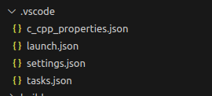
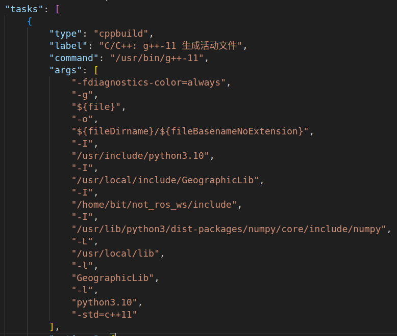
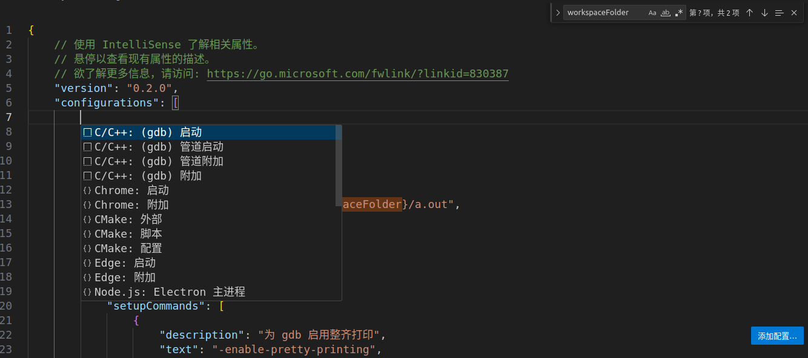
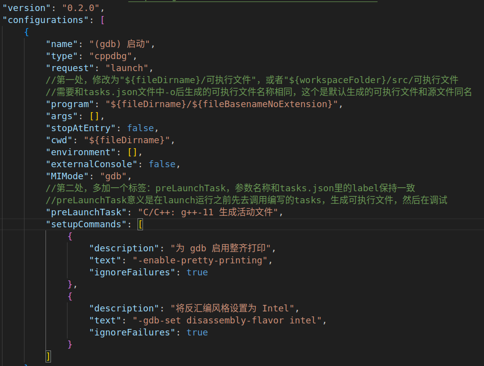
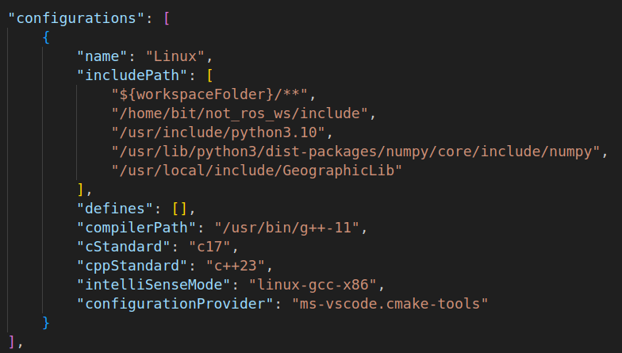

# LINUX学习

## 1.cat命令

1. 显示文件内容：`cat file.txt`，将显示文件`file.txt`的内容。
2. 连接多个文件：`cat file1.txt file2.txt`，将连接文件`file1.txt`和`file2.txt`的内容，并按顺序显示。
3. 创建文件：`cat > file.txt`，在命令行中输入内容，并按Ctrl+D结束输入，将内容保存到`file.txt`文件中。
4. 追加内容到文件：`cat >> file.txt`，在命令行中输入内容，并按Ctrl+D结束输入，将内容追加到`file.txt`文件的末尾。
5. 复制文件：`cat source.txt > destination.txt`，将`source.txt`文件的内容复制到`destination.txt`文件中。
6. 显示行号：`cat -n file.txt`，显示文件`file.txt`的内容，并在每一行前面加上行号。
7. 显示非空行：`cat -s file.txt`，显示文件`file.txt`的内容，将连续的空行压缩成一行显示。


## 2.shell脚本

学习网站：[Shell 教程 | 菜鸟教程 (runoob.com)](https://www.runoob.com/linux/linux-shell.html)

shell脚本对空格的要求非常严格

**1.变量**

**解释器**：第一行是解释器，类似规定这个脚本以什么方式运行`#!/bin/bash`

**引用**：变量引用需要加上`$变量`，或者是`${变量}`；还可以使用`$(hostname或ls catkin_ws等)`使用linux系统的命令引用参数

**赋值**：变量一般用大写子母表示；变量赋值一般等号左边和右边都不留空格，和编程不太一样

**删除变量**：`unset + 变量名称`注意变量名称前面不加`$`，只有具体数值传递时采用，删除后数据无法再使用

```bash
#!/bin/bash
echo "hello shell"
MY_NAME="XC" 
echo my name is ${MY_NAME}

cd catkin_ws
list=$(ls build)
echo $list

read -p "enter your name:" value_save
echo read test name is $value_save
unset value_save
echo "删除后的结果为：${value_save}"

declare -i my_int=42
# declare -A my_array
# my_array["name"]="xc"
# my_array["age"]=$my_int
echo "int类型的数据为：${my_int}"

echo ${PATH}
```


**2.传递参数**

获取参数的形式为`${n}`,**n** 代表一个数字，**1** 为执行脚本的第一个参数，**2** 为执行脚本的第二个参数

```bash
shell脚本命令
echo "shell传递参数"
echo "文件名称为${0}"
echo "第1个参数为${1}"
echo "第2个参数为${2}"
echo "第3个参数为${3}"

终端命令：./test_shell.sh 6 5 4
输出结果
shell传递参数
文件名称为./test_shell.sh
第1个参数为6
第2个参数为5
第3个参数为4
```


**3.流程**

**if函数**：

- 语法

- ```bash
  if condition          if condition
  then                  then
      command1               command1
      command2          elif 
      ...                    command1
  else                  else  
      command                command
  fi                    fi
  ```

- 判断语句格式：`[ ... ]`和`(( ... ))`，第一种的大于`-gt`，小于用`-lt`，第二种可以直接用运算符。需要注意的是无论哪一种，括号内部前和后，都需要用空格隔开，运算符也需要空格隔开

- ```bash
  a=10
  b=20
  if [ ${a} -lt ${b} ] #需要用空格隔开
  then
      echo "a小于b"
  else
      echo "a大于b"
  fi
  
  if (( ${a} < ${b} ))
  then
      echo "a小于b"
  else
      echo "a大于b"
  fi
  ```

  **for语句**

  - **语法：**in 列表可以包含替换、字符串和文件名。

  - ```bash
    for var in item1 item2 ... itemN
    do
        command1
        command2
        ...
        commandN
    done
    ```

  - 举例：`this is a string`例如这句话，如果不加双引号，就会按照单词依次输出，如果加上双引号，就是一个字符串，整句输出一次

  - ```bash
    for var in $(ls) #in后面的位置也可以换成1,2,3等，或者是字符串一句话，分别打印每个单词
    do
        echo $var
    done   
    ```

  **case语句**

  - **语法：**

  - 取值后面必须为单词 **in**，每一模式必须以右括号结束。取值可以为变量或常数，匹配发现取值符合某一模式后，其间所有命令开始执行直至 **;;**。

    取值将检测匹配的每一个模式。一旦模式匹配，则执行完匹配模式相应命令后不再继续其他模式。如果无一匹配模式，使用星号 ***** 捕获该值，再执行后面的命令。

    最后的结束语是case反过来

  - ```bash
    case 值 in
    模式1)
        command1
        command2
        ...
        commandN
        ;;
    模式2)
        command1
        command2
        ...
        commandN
        ;;
     *)
     	command
     	;;
    esac
    ```

    举例

  - ```bash
    echo '输入 1 到 4 之间的数字:'
    echo '你输入的数字为:'
    read aNum
    case $aNum in
        1)  echo '你选择了 1'
        ;;
        2)  echo '你选择了 2'
        ;;
        3)  echo '你选择了 3'
        ;;
        4)  echo '你选择了 4'
        ;;
        *)  echo '你没有输入 1 到 4 之间的数字'
        ;;
    esac
    ```

  

**4.函数**

  **返回值**：参数返回，可以显示加**return** 返回，如果不加，将以最后一条命令运行结果，作为返回值。 **return** 后跟数值 **n(0-255)**，用`$?`				用来接收函数的返回值，return只能返回数值，其他的不行

  **举例**：先写定义，和c++编程一样，但是在调用时不写括号

```bash
#!/bin/bash
funWithReturn(){
    echo "这个函数会对输入的两个数字进行相加运算..."
    echo "输入第一个数字: "
    read aNum
    echo "输入第二个数字: "
    read anotherNum
    echo "两个数字分别为 $aNum 和 $anotherNum !"
    return $(($aNum+$anotherNum))
}
funWithReturn
echo "输入的两个数字之和为 $? !"
```

**传参**：函数后面紧跟着参数，并不是编程的形参传递，传参可以是任何类型，但是返回值只能是0~255的int

```bash
funWithParam(){
    echo "第一个参数为 $1 !"
    echo "第二个参数为 $2 !"
    echo "第十个参数为 ${10} !"
    echo "第十一个参数为 ${11} !"
    echo "参数总数有 $# 个!"
    echo "作为一个字符串输出所有参数 $* !"
}
funWithParam 1 2 3 4 5 6 7 8 9 34 73
```


**5.启动其他脚本**

采用`.`的方式引入其他脚本，例如`. .test_shell02.sh`，注意两个点之间需要有空格


**6.启动新的终端**

`gnome-terminal -t " title-name " -x bash -c " sh ./test_shell02.sh; exec bash;"`

- `-t` 为打开终端的标题，便于区分
- `-x` 后面的为要在打开的终端中执行的脚本，根据需要自己修改就行了
- `exec bash;` 是让打开的终端在执行完脚本后不关闭
- ` bash -c` 执行shell命令


## 3.查找/结束进程

`ps aux | grep 软件`：查看当前ubuntu系统该软件的进程，例如`ps aux | grep gz`，举例输出为：

`kill 端口号 `杀死进程，如果实在没办法杀死，使用`kill -9 端口号`强制杀死

```
bit         3658  0.8  0.9 1177605916 157832 ?   SLl  11:33   0:02 /usr/share/code/code --unity-launch /home/bit/work/sim/gz_model/models/missile/model.sdf
bit         7967  0.0  0.0  12328  2496 pts/0    S+   11:37   0:00 grep --color=auto gz
```

这个情况就是有两个进程运行，一个是软件没有结束的，另一个是grep调起来的

进程一：`missile/model.sdf`一直在运行，3658是第一个的进程标识符（PID），使用`kill 3658`结束该进程；

进程二：第二个不算，是grep调用的gz进程，使用grep查找会自动调起来这个相关的进程


## 4.g++

```
g++ <选项>
```

* **-o <输出文件>**：指定输出文件名。
* **-Wall**：启用大多数警告消息。
* **-Werror**：将警告视为错误。
* **-std=c++XX**：指定要使用的C++语言标准（例如 `c++11`、`c++14`、`c++17`、`c++20`）。
* **-I<目录>**：将目录添加到用于搜索头文件的目录列表中。
* **-L<目录>**：将目录添加到用于搜索库文件的目录列表中。
* **-l<库>**：与指定的库进行链接。

举例

```
g++ -o my_program main.cpp function.cpp -I/usr/local/include/GeographicLib -L/usr/local/lib -lGeographicLib
```

* `-o my_program`：指定输出文件名为 `my_program`。
* `main.cpp functions.cpp`：指定要编译的源文件。
* `-I/usr/local/include/GeographicLib`：指定第三方库头文件目录 `.` 作为包含头文件的搜索路径。
* `-L/usr/local/lib`：指定第三方库库文件目录，作为包含库文件的搜索路径。
* `-lGeographicLib`：链接到名为 `GeographicLib` 的库文件。


## 5.vscode配置

在用vscode写c++项目时，构建一个项目通常有以下几种方式：

* 纯g++：纯vscode编译器配置g++
* 纯cmake：配置cmakelists，然后vscode再配置cmake
* ros版cmake：暂时还没有配置过vscode，未来可以摸索一下

首先要明白，配置vscode的目的都是**为了方便操作**，当然没有vscode配置时，也可以在ubuntu终端中运行以下命令。配置vscode就是为了方便操作，不用在终端中输入以下的东西了

* 纯g++项目：编译：`g++ -o -I -L`，运行：`./可执行文件`
* 纯cmake：编译：`mkdie build` --> `cd build` --> `cmake ..` --> `make` ，运行： `./可执行文件`
* ros2版cmake：编译`colcon build` ，运行：`ros2 run 包名 节点名称`

配置过程分为四个文件，tasks.json文件的作用是用编辑器通过g++生成可执行文件，launch.json是用于定义如何启动和配置调试器，c_cpp_properties.json是配置代码补全所需的头文件路径等一些信息，比如源文件include红色波浪线就是这个文件中的inlucdepath没有设置正确。具体的讲解可以参照https://blog.csdn.net/qq_59084325/article/details/125662393



**基本参数解释：**

* `"${file}"`                       当前源文件的完整路径，包含带扩展名的文件，例如`myproject(项目目录)/src/源文件.cpp`
* `"${fileDirname}" `          当前源文件所在文件夹的路径，不包括源文件，例如`myproject(项目目录)/src`
* `"${workspaceFolder}"`  当前工作区的路径，用vscode打开的文件夹的根路径，例如`myproject(项目目录)`

**1.tasks.json配置：**

生成：在cpp文件中按住`ctrl+shift+p`，在上方输入task，找到`任务：配置默认生成任务`，生成tasks.json文件

编写：tasks.json需要配置`-g -o -I -L -l`这些参数

* `-g`：在生成的可执行文件中包含调试信息，想要调试，就得加`-g`,`"${file}"`会自动替换成cpp源文件的路径
* `-o`：用于指定生成的可执行文件的输出路径和名称，`"${fileDirname}"`表示当前文件的目录路径 `"${fileBasenameNoExtension}"`表示将生成的可执行文件放在与源文件相同的目录中，并且使用源文件的名称作为可执行文件的名称。可以自己定义比如`${fileDirname}/a.out`，可执行文件就是`a.out`了
* `-I`：将后面列的==**头文件**==的**搜索路径**添加到这个项目中，一般在include文件夹下
* `-L`：将后面列的==**库文件**==的**搜索路径**添加到这个项目中，一般是.so文件，在lib文件夹下
* `-l`：将调用的第三方库和项目链接




**2.launch.json配置：**

生成：点击左侧栏运行和调试按钮，然后点击创建launch.json文件，在生成的两三行文件中点**右下角的添加配置**，选择`(gdb)启动`，生成默认的基本框架



配置：两个地方需要修改，修改`program`参数，多加`preLaunchTask`参数




**3.c_cpp_properties.json配置：**

生成：ctrl+shift+p输入`C/C++:编辑配置`，一种是UI，一种是json，UI就是正常选择，但是要在包含模块下把第三方的头文件都包含进去，都包含进去

配置：`"${workspaceFolder}"`是项目根目录，`/**`是向下逐级查找，c和c++一般选17以上




## 6.纯CMake编写

vscode和cmake联合配置（这个是纯用cmake构建的，没有涉及到g++的东西，vscode里的task.json就可以按照他的配置cmake make build）：https://blog.csdn.net/TU_Dresden/article/details/122414454

标准的一套流程：

```cmake
#最低版本要求：必须
cmake_minimum_required(VERSION 3.0)
#项目名称，版本：必须
project(My_test_project)

############非必须##############
#导入第三方库：非必须
find_package(库的名称 REQUIRED)  # REQUIRED 参数表示如果找不到会报错
#将第三方库的头文件添加到项目路径下
include_directories(库名称_INCLUDE_DIRS)
############非必须##############

#导入自己的include文件夹下的头文件
include_directories(include)  #将指定的目录添加到项目的包含路径
#添加可执行文件：必须
add_executable(想生成的可执行文件 源文件1.cpp 源文件2.cpp)
#不同的源文件是多文件调用的情况。只有一个文件中有main函数，其他文件中是函数的实现，

############非必须##############
#链接可执行文件和库文件：如果有第三方库，就需要链接
target_link_libraries(想生成的可执行文件 ${库名称1_LIBRARIES} ${库名称1_LIBRARIES})
############非必须##############
```

文件流程：

```css
project_Mytest/
│
├── CMakeLists.txt
│
├── include/
│   ├── header1.h
│   ├── header2.h
│   └── header3.h
└── src/
    ├── source1.cpp
    ├── source2.cpp
    ├── source3.cpp
    └── source4.cpp
```

编写流程：

```
####创建
mkdir -p not_ros_ws/src
cd not_ros_ws
mkdir build
mkdir include

####编译
cd build
cmake ..
make
```


## 7.ros版cmake

