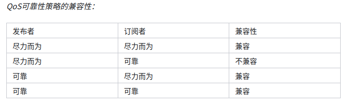

# **ROS2学习**

# 一、功能包

## 1.创建工作空间

```
mkdir -p ~/ros2_ws/src
cd ~/ros2_ws/src
```

## 2.创建功能包

```
ros2 pkg create --build-type ament_cmake (--node-name <node_name>) <package name>
```

`--node-name <node_name>`这一项可以省略，之后在cmakelist文件里面自己配置

# 二、话题通信

## 1.节点配置

**流程：**

1. `main`函数传参`int main(argc, *argv[])`

2. c++和ros2初始化`rclcpp::init(argc, argv);`

3. 创建节点，节点初始化`rclcpp::spin(std::make_shared<publisher>())`

   * 创建类对象，继承自`rclcpp::Node`

   * public作用域：构造函数内创建对象，调用this->发布者/订阅者/定时器对应的话题

   * private作用域：初始化变量，声明发布者/订阅者/定时器的智能指针

     ​						 回调函数1...回调函数n

4. 关闭ros2接口`rclcpp::shutdown()`

**分模块解析**：

```c++
int main(argc, *argv[])
```

表示参数的传递：

* `argc`：是`argument count`的缩写，表示传递给程序的命令行参数的数量，不包括程序名本身。例如，如果你在命令行运行`./myprogram arg1 arg2 arg3`，那么`argc`的值将是3，因为有3个参数（`arg1`, `arg2`, `arg3`）。
* `argv`：是`argument values`的缩写，是一个指向字符指针数组的指针，argv[0]`是可执行文件的名称，`argv[1]`是第一个参数，`argv[2]`是第二个参数，类推。

```c++
rclcpp::spin(std::make_shared<PublisherNode>()); 
```

`make_shared`创建了一个<自定义数据类型>的智能指针`shared_ptr`，格式：`make_shared<自定义数据类型>()`

`rclcpp::spin()`是循环node事件

```c++
class Publisher : public rclcpp::Node
{
public:
    Publisher()
    {
        publish_ = this->create_publisher<ros消息类型>("话题名称",缓冲队列)；
    }
private:
    rclcpp::Publisher<ros消息类型>::sharedPtr publish_;
    void callback1()
};
```


## 2.发布者

### 新语法

**std::bind：**

作用：将一个普通函数/成员函数绑定到一个对象中，直接`对象(数据)`就相当于函数的效果

绑定成员函数`std::bind(&MyClass::func1, &myObject, std::placeholders::_1, 20);`MyClass::func1传入自定义的类内的成员函数的指针，myObject是实例化对象，告诉是具体哪个对象的成员函数，std::placeholders::_1是占位符，传参时会替换成参数，最后的20就是函数的输入，比如`func1(int a,int b)`相当于让b等于20,a等待传参

### **定时器:**

数据类型：`rclcpp::TimeBase::SharedPtr timer_`

数据对象：`timer_ = this->create_wall_timer(500ms , std::bind(&Publisher::timer_callback , this))`

### **发布者:**

数据类型：`rclcpp::Publisher<数据类型>::SharedPtr publisher_`

数据对象：`publisher_ = this->create_publisher<数据类型>(“话题名称”, 缓冲队列长度)`

### 消息对象：

方法一：`数据类型 对象` ， 例如：`std_msgs::msg::String output`

方法二：`auto 对象 = 数据类型（）`，例如：`auto output = std_msgs::msg::String()`

### 示例：

```c++
#include <chrono>
#include <functional>
#include <memory>
#include <string>
#include "rclcpp/rclcpp.hpp"          // ROS2 C++接口库
#include "std_msgs/msg/string.hpp"    // 字符串消息类型
using namespace std::chrono_literals;
class PublisherNode : public rclcpp::Node
{
    public:
        PublisherNode()
        : Node("topic_helloworld_pub") // ROS2节点父类初始化
        {
            // 创建发布者对象（消息类型、话题名、队列长度）
            publisher_ = this->create_publisher<std_msgs::msg::String>("chatter", 10); 
            // 创建一个定时器,定时执行回调函数
            timer_ = this->create_wall_timer(
                500ms, std::bind(&PublisherNode::timer_callback, this));            
        }
    private:
        // 创建定时器周期执行的回调函数
        void timer_callback()                                                       
        {
          // 创建一个String类型的消息对象
          auto msg = std_msgs::msg::String();   
          // 填充消息对象中的消息数据                                    
          msg.data = "Hello World";
          // 发布话题消息                                                 
          RCLCPP_INFO(this->get_logger(), "Publishing: '%s'", msg.data.c_str()); 
          // 输出日志信息，提示已经完成话题发布   
          publisher_->publish(msg);                                                
        }
        rclcpp::TimerBase::SharedPtr timer_;                             // 定时器指针
        rclcpp::Publisher<std_msgs::msg::String>::SharedPtr publisher_;  // 发布者指针
};
// ROS2节点主入口main函数
int main(int argc, char * argv[])                      
{
    // ROS2 C++接口初始化
    rclcpp::init(argc, argv);                
    // 创建ROS2节点对象并进行初始化          
    rclcpp::spin(std::make_shared<PublisherNode>());   
    // 关闭ROS2 C++接口
    rclcpp::shutdown();                               
    return 0;
}

```


## 3.订阅者

### 订阅器

数据类型：`rclcpp::Subscription<消息类型>::SharedPtr output_`

对象类型：`output_ = this->creat_subscription<消息类型>("话题",缓冲队列长度,std::bind(&类名::回调函数, this , _1))`,_1表示占位符，在回调函数传参时候自动改为msg的数据。

### 回调函数：

`void callback(const 消息类型 & msg) const`，注意msg一定要写成&指针的形式，也可以用`消息类型::SharedPtr`智能指针的形式

## 4.CmakeLists编写

# 三、服务通信

## Qos问题：

**背景**：

* ros2的发布和订阅依靠消息质量Qos，在网络不好/数据不重要时采用UDP传输，在数据非常重要时候采用TCP传输保证可以接收到数据，而ros1只能采用TCP的方式传输数据，因此在网络不好的时候，依旧采用TCP来回确定的方式会造成数据无法接收的问题。
* ros2发布者和订阅者的可靠性都有`BEST_EFFECT`和`RELIABLE`两种模式，分别对应尽力而为和可靠，下面是两种可靠性的兼容关系，第二种情况不兼容



第二种情况的报错举例：`[WARN] [1710250781.712647750] [mytest]: New publisher discovered on topic '/fmu/out/vehicle_odometry', offering incompatible QoS. No messages will be sent to it. Last incompatible policy: RELIABILITY_QOS_POLICY`

**解决方法：**

将订阅者的可靠性改为尽力而为`BEST_EFFECT`，参考https://blog.csdn.net/weixin_42454034/article/details/106905418

* 方法一：在话题名称后面加上`rclcpp::SystemDefaultsQoS()`，是例如下

  ```c++
  odo_self_subscriber = this->create_subscription<VehicleOdometry>("/fmu/out/vehicle_odometry", rclcpp::SystemDefaultsQoS() ,[this](const VehicleOdometry::SharedPtr msg) {topic_callback(msg);});
  ```

* 方法二：在话题名称后面加上`rclcpp::QoS(rclcpp::KeepLast(1)).best_effort().transient_local()`，`best_effort()`是可选项，也可以选择为`reliable()`，是例如下：

  ```c++
  odo_self_subscriber = this->create_subscription<VehicleOdometry>("/fmu/out/vehicle_odometry", rclcpp::QoS(rclcpp::KeepLast(1)).best_effort().transient_local(), [this](const VehicleOdometry::SharedPtr msg) {topic_callback(msg);});
  ```

# 四、小知识

自定义消息数据中的数量，可以在回调函数中用.size()查看，例如自定义的消息为`point[] data`在接收程序中就可以用`msg->data.size()`查看一次发布了多少数据
