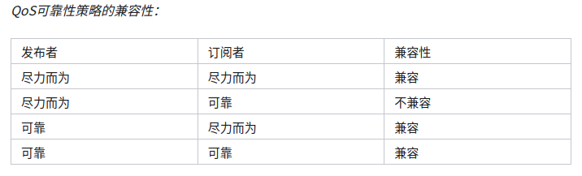

# **ROS2学习**

# 一、功能包

## **0.标准结构**

```
ros2_ws/
├── src/
│   ├── my_package/
│   │   ├── CMakeLists.txt
│   │   ├── package.xml
│   │   ├── README.md
│   │   ├── include/
│   │   │   └── my_package/
│   │   │       └── my_cpp_header.hpp
│   │   ├── src/
│   │   │   └── my_cpp_node.cpp
│   │   ├── scripts/
│   │   │   └── my_python_node.py
│   │   ├── msg/
│   │   │   └── MyMessage.msg
│   │   ├── launch/
│   │   │   └── my_package_launch.py
│   │   ├── config/
│   │   │   └── params.yaml
├── build/
├── install/
├── log/
```


## 1.创建工作空间

```
mkdir -p ~/ros2_ws/src
cd ~/ros2_ws/src
```

## 2.创建功能包

```
ros2 pkg create --build-type ament_cmake (--node-name <node_name>) <package name>
```

`--node-name <node_name>`这一项可以省略，之后在cmakelist文件里面自己配置

# 二、话题通信

## 1.节点配置

**流程：**

1. `main`函数传参`int main(argc, *argv[])`

2. c++和ros2初始化`rclcpp::init(argc, argv);`

3. 创建节点，节点初始化`rclcpp::spin(std::make_shared<publisher>())`

   * 创建类对象，继承自`rclcpp::Node`

   * public作用域：构造函数内创建对象，调用this->发布者/订阅者/定时器对应的话题

   * private作用域：初始化变量，声明发布者/订阅者/定时器的智能指针

     ​						 回调函数1...回调函数n

4. 关闭ros2接口`rclcpp::shutdown()`

**分模块解析**：

```c++
int main(argc, *argv[])
```

表示参数的传递：

* `argc`：是`argument count`的缩写，表示传递给程序的命令行参数的数量，不包括程序名本身。例如，如果你在命令行运行`./myprogram arg1 arg2 arg3`，那么`argc`的值将是3，因为有3个参数（`arg1`, `arg2`, `arg3`）。
* `argv`：是`argument values`的缩写，是一个指向字符指针数组的指针，argv[0]`是可执行文件的名称，`argv[1]`是第一个参数，`argv[2]`是第二个参数，类推。

```c++
rclcpp::spin(std::make_shared<PublisherNode>()); 
```

`make_shared`创建了一个<自定义数据类型>的智能指针`shared_ptr`，格式：`make_shared<自定义数据类型>()`

`rclcpp::spin()`是循环node事件

```c++
class Publisher : public rclcpp::Node
{
public:
    Publisher()
    {
        publish_ = this->create_publisher<ros消息类型>("话题名称",缓冲队列)；
    }
private:
    rclcpp::Publisher<ros消息类型>::sharedPtr publish_;
    void callback1()
};
```


## 2.发布者

### bind语法

**std::bind：**

作用：将一个普通函数/成员函数绑定到一个对象中，直接`对象(数据)`就相当于函数的效果

绑定成员函数`std::bind(&MyClass::func1, &myObject, std::placeholders::_1, 20);`MyClass::func1传入自定义的类内的成员函数的指针，myObject是实例化对象，告诉是具体哪个对象的成员函数，std::placeholders::_1是占位符，传参时会替换成参数，最后的20就是函数的输入，比如`func1(int a,int b)`相当于让b等于20,a等待传参

### **定时器:**

数据类型：`rclcpp::TimeBase::SharedPtr timer_`

类的写法，数据对象：`timer_ = this->create_wall_timer(500ms , std::bind(&Publisher::timer_callback , this))`

不是类的写法：`timer_ = this->create_wall_timer(chrono::millsecond(500) , timer_callback))`

### **发布者:**

数据类型：`rclcpp::Publisher<数据类型>::SharedPtr publisher_`

数据对象：`publisher_ = this->create_publisher<数据类型>(“话题名称”, 缓冲队列长度)`

### 消息对象：

方法一：`数据类型 对象` ， 例如：`std_msgs::msg::String output`

方法二：`auto 对象 = 数据类型（）`，例如：`auto output = std_msgs::msg::String()`

### 示例：

```c++
#include <chrono>
#include <functional>
#include <memory>
#include <string>
#include "rclcpp/rclcpp.hpp"          // ROS2 C++接口库
#include "std_msgs/msg/string.hpp"    // 字符串消息类型
using namespace std::chrono_literals;
class PublisherNode : public rclcpp::Node
{
    public:
        PublisherNode()
        : Node("topic_helloworld_pub") // ROS2节点父类初始化
        {
            // 创建发布者对象（消息类型、话题名、队列长度）
            publisher_ = this->create_publisher<std_msgs::msg::String>("chatter", 10); 
            // 创建一个定时器,定时执行回调函数
            timer_ = this->create_wall_timer(
                500ms, std::bind(&PublisherNode::timer_callback, this));            
        }
    private:
        // 创建定时器周期执行的回调函数
        void timer_callback()                                                       
        {
          // 创建一个String类型的消息对象
          auto msg = std_msgs::msg::String();   
          // 填充消息对象中的消息数据                                    
          msg.data = "Hello World";
          // 发布话题消息                                                 
          RCLCPP_INFO(this->get_logger(), "Publishing: '%s'", msg.data.c_str()); 
          // 输出日志信息，提示已经完成话题发布   
          publisher_->publish(msg);                                                
        }
        rclcpp::TimerBase::SharedPtr timer_;                             // 定时器指针
        rclcpp::Publisher<std_msgs::msg::String>::SharedPtr publisher_;  // 发布者指针
};
// ROS2节点主入口main函数
int main(int argc, char * argv[])                      
{
    // ROS2 C++接口初始化
    rclcpp::init(argc, argv);                
    // 创建ROS2节点对象并进行初始化          
    rclcpp::spin(std::make_shared<PublisherNode>());   
    // 关闭ROS2 C++接口
    rclcpp::shutdown();                               
    return 0;
}

```


## 3.订阅者

### 订阅器

数据类型：`rclcpp::Subscription<消息类型>::SharedPtr output_`

对象类型：`output_ = this->creat_subscription<消息类型>("话题",缓冲队列长度,std::bind(&类名::回调函数, this , _1))`,_1表示占位符，在回调函数传参时候自动改为msg的数据。

### 回调函数：

`void callback(const 消息类型 & msg) const`，注意msg一定要写成&指针的形式，也可以用`消息类型::SharedPtr`智能指针的形式

## 4.CmakeLists编写

ros2包必须包含package.xml和cmakelists文件

### 1.cmakelists示例：

**cmakelist的工程名称`project(...)`必须和package中包的名称保持一致**

**必须命令：**

| 命令                                  | 功能                                                         |
| ------------------------------------- | ------------------------------------------------------------ |
| `cmake_minimum_required(VERSION ...)` | 指定CMake的最低版本要求。                                    |
| `project(...)`                        | 定义项目名称及语言等信息。                                   |
| `find_package(ament_cmake REQUIRED)`  | 引入ROS 2构建工具。必须。                                    |
| `find_package(...)`                   | 查找依赖的包，如 `rclcpp`、`std_msgs`、`sensor_msgs`等。每个依赖都需明确声明。 |
| `add_executable(...)`                 | 添加可执行文件（如节点）。                                   |
| `ament_target_dependencies(...)`      | 为可执行文件声明依赖库。                                     |
| `install(TARGETS ...)`                | 安装可执行文件，使得可以通过 `ros2 run` 调用。               |
| `ament_package()`                     | 必须，标识这是一个 ROS 2 包。必须放在文件底部。              |

**非必须命令：**

| 命令                                         | 说明                                   |
| -------------------------------------------- | -------------------------------------- |
| `add_library(...)`                           | 如果你写的是库而不是节点，用来构建库。 |
| `install(DIRECTORY include/...)`             | 安装头文件（对于库项目有用）。         |
| `rosidl_generate_interfaces(...)`            | 如果定义了自定义消息/服务时必须。      |
| `enable_testing()` 和 `ament_add_gtest(...)` | 如果需要写测试用例时使用。             |
| `target_include_directories(...)`            | 手动添加头文件路径时使用。             |
| `ament_export_dependencies(...)`             | 如果你的库被别的包引用，需导出依赖。   |

模板示例：

```cmake
cmake_minimum_required(VERSION 3.8)
project(my_ros2_node)

# 指定使用 C++17
if(NOT CMAKE_CXX_STANDARD)
  set(CMAKE_CXX_STANDARD 17)
endif()

# 查找必须的依赖包
find_package(ament_cmake REQUIRED)
find_package(rclcpp REQUIRED)
find_package(std_msgs REQUIRED)
find_package(rosidl_default_generators REQUIRED)

# 添加可执行节点
add_executable(talker src/talker.cpp)
add_executable(listener src/listener.cpp)

# 添加include路径和库文件的路径
ament_target_dependencies(talker rclcpp std_msgs)
ament_target_dependencies(listener rclcpp std_msgs)

# 自定义消息
rosidl_generate_interfaces(${PROJECT_NAME}
  "msg/MyMsg.msg"
  "srv/MySrv.srv"
)

# 安装可执行文件
install(TARGETS
  talker
  listener
  DESTINATION lib/${PROJECT_NAME}
)

# 必须的宏
ament_package()

```

### 2.ament_target_dependencies

（1）基础知识

根据`find_package`后cmake自动生成的变量，将这些find得到的包的头文件目录和库文件目录添加到可执行程序中

`ament_target_dependencies`实际上是对` target_include_directories `和 `target_link_libraries `的封装，是ros2自己封装好的，就不需要自己手动在配置了

| 特性           | target_link_libraries                      | ament_target_dependencies                   |
| -------------- | ------------------------------------------ | ------------------------------------------- |
| 来源           | CMake 标准命令                             | ROS 2 ament_cmake 专用宏                    |
| 主要功能       | 链接库文件，设置头文件路径（需手动配置）   | 自动处理 ROS 2 依赖的头文件、库和消息配置   |
| 适用场景       | 通用 C++ 项目，需精确控制链接行为          | ROS 2 项目，简化依赖管理                    |
| 头文件路径     | 需通过 target_include_directories 手动指定 | 自动添加依赖的头文件路径                    |
| 依赖管理       | 需手动确保所有依赖的库和头文件正确配置     | 自动解析 find_package 和 package.xml 的依赖 |
| ROS 2 消息支持 | 不直接支持，需手动处理消息生成的头文件和库 | 自动支持 ROS 2 消息和服务生成的头文件和库   |
| 复杂性         | 配置较复杂，适合低级控制                   | 配置简单，适合 ROS 2 生态                   |
| 依赖传递       | 可通过 PUBLIC/PRIVATE/INTERFACE 控制       | 自动处理依赖传递，符合 ROS 2 规范           |

**举例**：

```cmake
ament_target_dependencies(my_node PUBLIC rclcpp std_msgs)
等价于
target_include_directories(my_node PUBLIC ${rclcpp_INCLUDE_DIRS} ${std_msgs_INCLUDE_DIRS})
target_link_libraries(my_node PUBLIC ${rclcpp_LIBRARIES} ${std_msgs_LIBRARIES})
```

**第一种方式**：不使用ros2，因此需要手动指定头文件路径（target_include_directories）和库，比较麻烦

```cmake
find_package(rclcpp REQUIRED)
find_package(geometry_msgs REQUIRED)
#需要手动指定include的文件夹
target_include_directories(my_node PUBLIC ${rclcpp_INCLUDE_DIRS}  ${geometry_msgs_INCLUDE_DIRS})
target_link_libraries(my_node  rclcpp::rclcpp  geometry_msgs::geometry_msgs)
add_executable(my_node src/my_node.cpp)
```

**第二种方式**：使用ros2

```cmake
find_package(rclcpp REQUIRED)
find_package(geometry_msgs REQUIRED)
#一行命令直接高定对库的链接和依赖
ament_target_dependencies(my_node rclcpp geometry_msgs)
add_executable(my_node src/my_node.cpp)
```

（2）注意事项

`ament_target_dependencies(my_node rclcpp geometry_msgs)`后面括号中的`geometry_msgs`等名称,必须和`find_package(geometry_msgs)`中括号里的名称保持完全一致，ros2封装的是直接根据名称匹配`find_package`后找到的`库_INCLUDE`等参数的

### 3.rosidl_generate_interfaces

（1）作用

用于生成 ROS 2 消息（.msg）、服务（.srv）或动作（.action）文件的接口代码，将 .msg、.srv 和 .action 文件编译为目标语言（如 C++、Python）的头文件、源文件或模块，以便在 ROS 2 节点中发布、订阅或调用这些接口

生成的接口会被安装到标准位置（如 install//share/<package_name>），然后`source install setup.bash`就能找到这个自定义的消息了

（2）举例

```cmake
rosidl_generate_interfaces(${PROJECT_NAME}
  "msg/MyMessage.msg"
  "srv/MyService.srv"
  "action/MyAction.action"
  DEPENDENCIES std_msgs
)
```

### 4.install

（1）作用

用于指定在构建项目后如何将生成的目标文件（如可执行文件、库文件）或其他文件（配置文件、文档等）安装到指定的目标目录中

在ros2中，一般都需要有这个install，作用都是将可执行文件安装到install文件夹下，然后`source install/setup.bash`就能找到这个可执行程序，然后执行`ros2 run <包名> 可执行文件名称`

（2）语法

```cmake
install(TARGETS target_name
        [RUNTIME DESTINATION <dir>]  # 可执行文件
        [LIBRARY DESTINATION <dir>]  # 动态库
        [ARCHIVE DESTINATION <dir>]  # 静态库
)


add_executable(offboard_attitude_control src/examples/offboard/offboard_attitude_control.cpp)
ament_target_dependencies(offboard_attitude_control rclcpp px4_msgs)
install(TARGETS offboard_attitude_control DESTINATION lib/${PROJECT_NAME}) #就是将offboard_attitude_control安装到install/lib/包名/，路径下
```


### 5.ament_export_dependencies

（1）作用

将当前包mypackage的依赖（通过 find_package 查找的包）导出到下游包nextpackage，下游包只需要find_package当前包，就能找到mypackage中所有的依赖关系，而无需在在nextpackage中find其他的包

ament_export_dependencies 的核心功能是将当前包的依赖关系导出到其 **CMake 配置文件**（通常是 Config.cmake），以便下游包可以自动获取这些依赖的配置信息。

（2）**举例**：

上游包package1

```cmake
find_package(rclcpp REQUIRED)
find_package(std_msgs REQUIRED)
ament_export_dependencies(rclcpp std_msgs)
```

下游包package2

```cmake
find_package(package1 REQUIRED)
ament_target_dependencies(my_node2 package1)
ament_target_dependencies(my_node2 rclcpp std_msgs)
```

## 5.package.xml编写

**cmakelist的工程名称`project(...)`必须和package中包的名称保持一致，由package来定义**

`package.xml` 是 **ROS 2 功能包的元数据文件**，它的主要作用是为构建工具（如 `colcon`）、依赖管理工具（如 `rosdep`）以及其他 ROS 工具链提供关于这个功能包的**基本信息和依赖信息**。

以一个包含 C++ 节点的 ROS 2 功能包为例，它的 `package.xml` 作用包括：

* 告诉系统这个包叫 `my_robot_node`，版本是 1.0；
* 告诉 `colcon` 需要用 `ament_cmake` 构建；
* 告诉 `colcon` 编译时需要 `rclcpp` 和 `std_msgs`；
* 告诉 `ros2 run` 怎么找到这个包编译生成的可执行文件；
* 告诉 `rosdep` 在缺依赖时如何自动安装。

基本参数解释：

| 标签                 | 说明                                                         |
| -------------------- | ------------------------------------------------------------ |
| `<buildtool_depend>` | 构建工具依赖，ROS 2 使用 `ament_cmake` 或 `ament_python`。   |
| `<build_depend>`     | 编译时所需依赖（头文件、链接库等）。一般要和cmakelist的find_package对应起来 |
| `<exec_depend>`      | 运行时所需依赖（例如运行节点时需要的库）。                   |
| `<depend>`           | 同时作为 `build` 和 `exec` 的快捷写法（不推荐）。            |
| `<export>`           | 用于声明构建类型、插件导出等                                 |

以下是一个模板：

```xml
<?xml version="1.0"?>
<package format="3">
  <name>my_custom_msgs</name>
  <version>0.1.0</version>
  <description>Custom message definitions for my project</description>

  <maintainer email="yourname@example.com">Your Name</maintainer>
  <license>Apache-2.0</license>

  <!-- 基本构建工具 -->
  <buildtool_depend>ament_cmake</buildtool_depend>
    <buildtool_depend>ament_cmake_python</buildtool_depend>

  <!-- 生成和运行消息接口的依赖 -->
  <build_depend>rosidl_default_generators</build_depend>
  <exec_depend>rosidl_default_runtime</exec_depend>

  <!-- 使用标准内建类型 -->
  <build_depend>builtin_interfaces</build_depend>
  <exec_depend>builtin_interfaces</exec_depend>

  <depend>rclpy</depend>
  <depend>rclcpp</depend>
  <depend>sensor_msgs</depend>
  <depend>geometry_msgs</depend>
  <depend>cv_bridge</depend>
  <depend>eigen3</depend>

  <depend>std_msgs</depend> <!-- 这行话等同于下面两行话 -->
  <build_depend>std_msgs</build_depend>
  <exec_depend>std_msgs</exec_depend>

  <export>
    <build_type>ament_cmake</build_type>
  </export>
</package>

```


## 6.自定义消息

步骤一：新建msgs文件夹，在文件夹中新建消息文件

步骤二：在package.xml中定义

```xml
<!-- 包名定义 -->
<name>my_package</name>
<!-- 生成和运行消息接口的依赖 -->
<build_depend>rosidl_default_generators</build_depend>
```

步骤三：在camelist中编写：

```cmake
project(my_package) #必须和package.xml中的包名保持一致
rosidl_generate_interfaces(${PROJECT_NAME}
  "msg/MyMessage.msg" #示例，自定义的消息
  "srv/MyService.srv"
  "action/MyAction.action"
  DEPENDENCIES std_msgs
)
```

步骤四：编译自定义消息

```
colcon build --packages-select my_msgs
```

步骤五：导入c++或python

c++中会自动将大写转为小写，并在前面加一个下划线（第一个大写字母除外），驼峰转下划线。

python中依旧保持驼峰，需要import对应的消息包

```c++
include "my_package/msgs/my_message"
```

```python
from my_package.msgs import MyMessage
```


# 三、服务通信

## Qos问题：

**背景**：

* ros2的发布和订阅依靠消息质量Qos，在网络不好/数据不重要时采用UDP传输，在数据非常重要时候采用TCP传输保证可以接收到数据，而ros1只能采用TCP的方式传输数据，因此在网络不好的时候，依旧采用TCP来回确定的方式会造成数据无法接收的问题。
* ros2发布者和订阅者的可靠性都有`BEST_EFFECT`和`RELIABLE`两种模式，分别对应尽力而为和可靠，下面是两种可靠性的兼容关系，第二种情况不兼容



第二种情况的报错举例：`[WARN] [1710250781.712647750] [mytest]: New publisher discovered on topic '/fmu/out/vehicle_odometry', offering incompatible QoS. No messages will be sent to it. Last incompatible policy: RELIABILITY_QOS_POLICY`

**解决方法：**

将订阅者的可靠性改为尽力而为`BEST_EFFECT`，参考https://blog.csdn.net/weixin_42454034/article/details/106905418

* 方法一：在话题名称后面加上`rclcpp::SystemDefaultsQoS()`，是例如下

  ```c++
  odo_self_subscriber = this->create_subscription<VehicleOdometry>("/fmu/out/vehicle_odometry", rclcpp::SystemDefaultsQoS() ,[this](const VehicleOdometry::SharedPtr msg) {topic_callback(msg);});
  ```

* 方法二：在话题名称后面加上`rclcpp::QoS(rclcpp::KeepLast(1)).best_effort().transient_local()`，`best_effort()`是可选项，也可以选择为`reliable()`，是例如下：

  ```c++
  odo_self_subscriber = this->create_subscription<VehicleOdometry>("/fmu/out/vehicle_odometry", rclcpp::QoS(rclcpp::KeepLast(1)).best_effort().transient_local(), [this](const VehicleOdometry::SharedPtr msg) {topic_callback(msg);});
  ```

# 四、小知识

自定义消息数据中的数量，可以在回调函数中用.size()查看，例如自定义的消息为`point[] data`在接收程序中就可以用`msg->data.size()`查看一次发布了多少数据

ros获取时间

```c++
//创建接受对象
rclcpp::Time start_time, end_time;
//第一种，标准数据格式
end_time = rclcpp::Clock().now(); //在Clock后面一定要加上（）
//第二种，class类内
start_time = this->now();

//计算时间差
double duration = end_time.second() - start_time.second(); //调用rclcpp::Time的成员函数second
```

