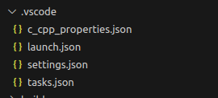
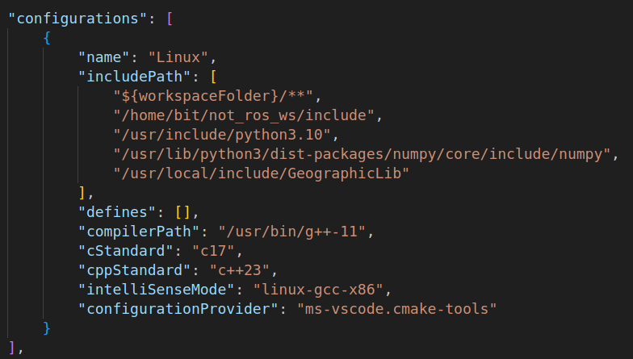

VScode配置

## vscode配置

在用vscode写c++项目时，构建一个项目通常有以下几种方式：

* 纯g++：纯vscode编译器配置g++
* 纯cmake：配置cmakelists，然后vscode再配置cmake
* ros版cmake：暂时还没有配置过vscode，未来可以摸索一下

首先要明白，配置vscode的目的都是**为了方便操作**，当然没有vscode配置时，也可以在ubuntu终端中运行以下命令。配置vscode就是为了方便操作，不用在终端中输入以下的东西了

* 纯g++项目：编译：`g++ -o -I -L`，运行：`./可执行文件`
* 纯cmake：编译：`mkdie build` --> `cd build` --> `cmake ..` --> `make` ，运行： `./可执行文件`
* ros2版cmake：编译`colcon build` ，运行：`ros2 run 包名 节点名称`

配置过程分为四个文件，tasks.json文件的作用是用编辑器通过g++生成可执行文件，launch.json是用于定义如何启动和配置调试器，c_cpp_properties.json是配置代码补全所需的头文件路径等一些信息，比如源文件include红色波浪线就是这个文件中的inlucdepath没有设置正确。具体的讲解可以参照https://blog.csdn.net/qq_59084325/article/details/125662393



**基本参数解释：**

* `"${file}"`                       当前源文件的完整路径，包含带扩展名的文件，例如`myproject(项目目录)/src/源文件.cpp`
* `"${fileDirname}" `          当前源文件所在文件夹的路径，不包括源文件，例如`myproject(项目目录)/src`
* `"${workspaceFolder}"`  当前工作区的路径，用vscode打开的文件夹的根路径，例如`myproject(项目目录)`

**1.tasks.json配置：**

生成：在cpp文件中按住`ctrl+shift+p`，在上方输入task，找到`任务：配置默认生成任务`，生成tasks.json文件

编写：tasks.json需要配置`-g -o -I -L -l`这些参数

* `-g`：生成的可执行文件的文件,`"${file}"`会自动替换成cpp源文件的路径，如果在src中有多个源文件，共同生成一个可执行文件，例如.h文件的实现.cpp，那么在编译时，需要全部选上，==**不能只是`${file}`，需要改为`${fileDirname}/*.cpp （注意区分linux和windows下的斜杠表达方式，一个是/，另一个是\\）`**==当前文件夹下所有的cpp源文件都需要编译。报错连接：[vscode下编译告警“undefined reference”？三步教你如何解决_vscode undefined reference to-CSDN博客](https://blog.csdn.net/squall0984/article/details/107637986)
* `-o`：用于指定生成的可执行文件的输出路径和名称，`"${fileDirname}"`表示当前文件的目录路径 `"${fileBasenameNoExtension}"`表示将生成的可执行文件放在与源文件相同的目录中，并且使用源文件的名称作为可执行文件的名称。可以自己定义比如`${fileDirname}/a.out`，可执行文件就是`a.out`了
* `-I`：将后面列的==**头文件**==的**搜索路径**添加到这个项目中，一般在include文件夹下
* `-L`：将后面列的==**库文件**==的**搜索路径**添加到这个项目中，在lib文件夹下。ubuntu下一般是`.so`文件，windows下一般是`.lib`后缀文件，目的是为了让编译器找到后面的`-l`参数，相当于给`-l`参数提供了一个搜索路径
* `-l`：需要链接的库名，不加前缀lib，不加后缀so/dll，例子：一个库名是m，他的库文件名是libm.so，把库文件名的头lib和尾.so去掉就是库名了
* 链接参数解释：[GCC 命令行详解 -L 指定库的路径 -l 指定需连接的库名 - cy163 - 博客园 (cnblogs.com)](https://www.cnblogs.com/cy163/archive/2009/03/12/1409434.html)


**2.launch.json配置：**

**ubuntu配置：**

生成：点击左侧栏运行和调试按钮，然后点击创建launch.json文件，在生成的两三行文件中点**右下角的添加配置**，选择`(gdb)启动`，生成默认的基本框架


配置：两个地方需要修改，修改`program`参数，多加`preLaunchTask`参数


**windows配置：**

还要选择gdb启动，和ubuntu流程一样，但是要在多出来的`miDebuggerPath:`选项后面改成自己`MinGW`内置的gdb路径

```
"program": "${fileDirname}\\${fileBasenameNoExtension}.exe"，

"miDebuggerPath": "G:/MinGW/x86_64-8.1.0-release-posix-seh-rt_v6-rev0/mingw64/bin/gdb.exe",
```


**3.c_cpp_properties.json配置：**

生成：ctrl+shift+p输入`C/C++:编辑配置`，一种是UI，一种是json，UI就是正常选择，但是要在包含模块下把第三方的头文件都包含进去，都包含进去

配置：`"${workspaceFolder}"`是项目根目录，`/**`是向下逐级查找，c和c++一般选17以上




## c++调用matplotlib库（ubuntu）

vscode和cmakelist配置：https://blog.csdn.net/H460367792/article/details/122760804

vscode在windows下的配置：[vscode下c++使用matplotlib-cpp的环境配置教程_vscode配置matplotlibcpp-CSDN博客](https://blog.csdn.net/weixin_43455581/article/details/127311779)

vscode中的`-l`,`python310`动态库的配置：[windows下vscode环境c++利用matplotlibcpp绘图_c++图表展示折线图(vscode)-CSDN博客](https://blog.csdn.net/weixin_43769166/article/details/118365416)

误区：只配置cmake，不配置vscode，结果是在vscode的cmake工具编译后，在ubutnu终端中输入./可执行文件是可以运行的，但是没办法在vscode有右上角点击启动按钮进行运行

在项目的include文件夹下拷贝一份matplotlib.h头文件

cmake示例：

```cmake
cmake_minimum_required(VERSION 3.0)
project(My_test_project)

# 导入第三方库
find_package(GeographicLib REQUIRED)
include_directories(${GeographicLib_DIRS})
find_package(PythonLibs REQUIRED)
set(PYTHON_INCLUDE_DIRS /usr/include/python3.10)
set(PYTHON_LIBRARIES /usr/lib/python3.10/config-3.10-x86_64-linux-gnu/libpython3.10.so)
include_directories(${PYTHON_INCLUDE_DIRS})
include_directories(include)
# 生成可执行文件
add_executable(track src/track.cpp)
# 链接库文件
target_link_libraries(track ${GeographicLib_LIBRARIES} ${PYTHON_LIBRARIES})
```

vscode配置：

c_cpp_properties.josn

```c++
{
    "configurations": [
        {
            "name": "Linux",
            "includePath": [
                "${workspaceFolder}/**",
                "/home/bit/not_ros_ws/include",
                "/usr/include/python3.10",
                "/usr/lib/python3/dist-packages/numpy/core/include/numpy",
                // "/usr/local/include/GeographicLib"
            ],
            "defines": [],
            "compilerPath": "/usr/bin/gcc",
            "cStandard": "c17",
            "cppStandard": "gnu++17",
            "intelliSenseMode": "linux-gcc-x64",
            "configurationProvider": "ms-vscode.cmake-tools"
        }
    ],
    "version": 4
}
```

tasks.json

```c++
{
	"version": "2.0.0",
	"tasks": [
		{
			"type": "cppbuild",
			"label": "C/C++: g++-11 生成活动文件",
			"command": "/usr/bin/g++-11",
			"args": [
				"-fdiagnostics-color=always",
				"-g",
				"${file}",
				"-o",
				"${fileDirname}/${fileBasenameNoExtension}",
				"-I",
				"/usr/include/python3.10",
				"-I",
				"/usr/local/include/GeographicLib",
				"-I",
				"/home/bit/not_ros_ws/include",
				"-I",
				"/usr/lib/python3/dist-packages/numpy/core/include/numpy",
				"-L",
                // "/usr/local/lib",
                // "-l","Geographiclib",
				"-l","python3.10",
				"-std=c++11"
			],
			"options": {
				"cwd": "${fileDirname}"
			},
			"problemMatcher": [
				"$gcc"
			],
			"group": {
				"kind": "build",
				"isDefault": true
			},
			"detail": "编译器: /usr/bin/g++-11"
		}
	]
}
```


## c++调用matplotlib库（window）

### 配置python及第三方库

麻烦的地方在于配置本地的python环境和对应的numpy于matplotlib包

配置python环境：本次尝试没有使用conda，而是在本地下载了python3.10环境，csdn搜索即可，官网下载环境+配置环境变量“path”

下载numpy包：直接运行pip install numpy，如果系统有多个python时，不知道会将包安装在哪，这时就需要使用github这位老哥的解答

[没有名为“numpy.core._multiarray_umath”的模块 · 问题 #21678 · numpy/numpy --- No module named 'numpy.core._multiarray_umath' · Issue #21678 · numpy/numpy (github.com)](https://github.com/numpy/numpy/issues/21678)


在windows下调用cmd，在终端中运行命令`G:\python\python\python.exe -m pip install --force-reinstall numpy matplotlib `

- `G:\python\python`是python的安装路径，路径底下有一个python.exe的命令，要再进一步到python.exe中
- `--force-reinstall`会卸载原来的版本，安装新的版本
- `numpy(numpy==1.25.2) `后面可以跟着指定的版本
- `-i https://pypi.tuna.tsinghua.edu.cn/simple`这个参数选填，是从清华源下载，速度很快
- 所有的第三方库都可以按照这个命令安装到**指定的python环境中**

有时候安装报错很多红色的，可能是有梯子的原因，关闭梯子重试，链接[Python出现ValueError: check_hostname requires server_hostname如何解决-CSDN博客](https://blog.csdn.net/Carifee/article/details/119653989)

### vscode配置

基本的vscode配置需要完成，以下不赘述基础的vscode中4个文件的配置

配置方法：[vscode下c++使用matplotlib-cpp的环境配置教程_vscode配置matplotlibcpp-CSDN博客](https://blog.csdn.net/weixin_43455581/article/details/127311779?ops_request_misc=%7B%22request%5Fid%22%3A%22170394168716800215061964%22%2C%22scm%22%3A%2220140713.130102334..%22%7D&request_id=170394168716800215061964&biz_id=0&utm_medium=distribute.pc_search_result.none-task-blog-2~all~sobaiduend~default-2-127311779-null-null.142^v99^pc_search_result_base1&utm_term=vscode安装matplotlib&spm=1018.2226.3001.4187)，但是略微还有些问题，主要是launch.json中需要添加python的环境

c_cpp_properties.json文件配置

```json
{
    "configurations": [
        {
            "name": "Win32",
            "includePath": [
                "${workspaceFolder}/**",
                "F:\\project\\tiaojian\\plan_traj\\include\\**",
                //添加这两行 ，一个是python的头文件，另一个是numpy的头文件
                "G:\\python\\python\\include",
                "G:\\python\\python\\Lib\\site-packages\\numpy\\_core\\include"
                //改这两行的头文件
            ],
            "defines": [
                "_DEBUG",
                "UNICODE",
                "_UNICODE"
            ],
            "windowsSdkVersion": "8.1",
            "compilerPath": "G:/MinGW/x86_64-8.1.0-release-posix-seh-rt_v6-rev0/mingw64/bin/g++.exe",
            "cStandard": "c17",
            "cppStandard": "c++17",
            "intelliSenseMode": "windows-clang-x64"
        }
    ],
    "version": 4
}
```

launch文件配置

```json
{
    "version": "0.2.0",
    "configurations": [
        {
            "name": "(gdb) 启动",
            "type": "cppdbg",
            "request": "launch",
            "program": "${fileDirname}\\${fileBasenameNoExtension}.exe",
            "args": [],
            "stopAtEntry": false,
            "cwd": "${fileDirname}",
            //多添加这一行，提供python的“PYTHONHOME”路径为自己的python安装路径，到python.exe这一级
            "environment": [{"name": "PYTHONHOME", "value": "G:\\python\\python"}],
            //新增这一行
            "externalConsole": false,
            "MIMode": "gdb",
            "miDebuggerPath": "G:/MinGW/x86_64-8.1.0-release-posix-seh-rt_v6-rev0/mingw64/bin/gdb.exe",
            "preLaunchTask": "C/C++: g++.exe 生成活动文件",
            "setupCommands": [
                {
                    "description": "为 gdb 启用整齐打印",
                    "text": "-enable-pretty-printing",
                    "ignoreFailures": true
                },
                {
                    "description": "将反汇编风格设置为 Intel",
                    "text": "-gdb-set disassembly-flavor intel",
                    "ignoreFailures": true
                }
            ]
        }
    ]
}
```

tasks.json配置

```json
{
	"version": "2.0.0",
	"tasks": [
		{
			"type": "cppbuild",
			"label": "C/C++: g++.exe 生成活动文件",
			"command": "G:/MinGW/x86_64-8.1.0-release-posix-seh-rt_v6-rev0/mingw64/bin/g++.exe",
			"args": [
				"-fdiagnostics-color=always",
				"-g",
				"${fileDirname}\\*.cpp",
				"-I",
				"F:\\project\\tiaojian\\plan_traj\\include",
                //添加python和numpy的路径
				"-I",
				"G:\\python\\python\\include",
				"-I",
				"G:\\python\\python\\Lib\\site-packages\\numpy\\_core\\include",
                //添加python链接的库文件路径
				"-L",
				"G:\\python\\python",
                //链接库文件，在路径下的动态库，库文件名称为python310.dll，这是一个动态库，链接时候在g++中不写lib头，不写库文件后缀，例如.dll/.lib/.so
				"-l","python310",
				"-o",
				"${fileDirname}\\${fileBasenameNoExtension}.exe"
			],
			"options": {
				"cwd": "G:/MinGW/x86_64-8.1.0-release-posix-seh-rt_v6-rev0/mingw64/bin"
			},
			"problemMatcher": [
				"$gcc"
			],
			"group": {
				"kind": "build",
				"isDefault": true
			},
			"detail": "编译器: G:/MinGW/x86_64-8.1.0-release-posix-seh-rt_v6-rev0/mingw64/bin/g++.exe"
		}
	]
}
```

