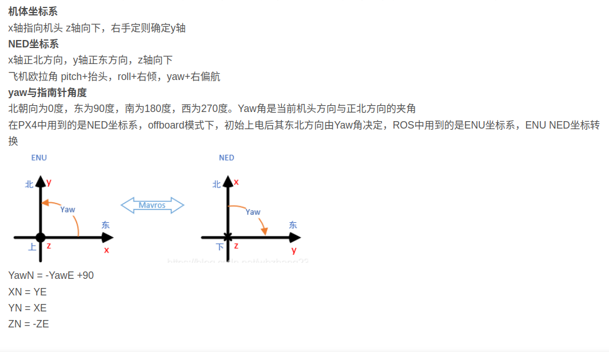

# c++应用

主要来记录实际应用时，总结的解决方式

## 1.ENU和NED坐标系转化：




## 2.c++调用matplotlib库（ubuntu）

vscode和cmakelist配置：https://blog.csdn.net/H460367792/article/details/122760804

误区：只配置cmake，不配置vscode，结果是在vscode的cmake工具编译后，在ubutnu终端中输入./可执行文件是可以运行的，但是没办法在vscode有右上角点击启动按钮进行运行

在项目的include文件夹下拷贝一份matplotlib.h头文件

cmake示例：

```cmake
cmake_minimum_required(VERSION 3.0)
project(My_test_project)

# 导入第三方库
find_package(GeographicLib REQUIRED)
include_directories(${GeographicLib_DIRS})
find_package(PythonLibs REQUIRED)
set(PYTHON_INCLUDE_DIRS /usr/include/python3.10)
set(PYTHON_LIBRARIES /usr/lib/python3.10/config-3.10-x86_64-linux-gnu/libpython3.10.so)
include_directories(${PYTHON_INCLUDE_DIRS})
include_directories(include)
# 生成可执行文件
add_executable(track src/track.cpp)
# 链接库文件
target_link_libraries(track ${GeographicLib_LIBRARIES} ${PYTHON_LIBRARIES})
```

vscode配置：

c_cpp_properties.josn

```c++
{
    "configurations": [
        {
            "name": "Linux",
            "includePath": [
                "${workspaceFolder}/**",
                "/home/bit/not_ros_ws/include",
                "/usr/include/python3.10",
                "/usr/lib/python3/dist-packages/numpy/core/include/numpy",
                // "/usr/local/include/GeographicLib"
            ],
            "defines": [],
            "compilerPath": "/usr/bin/gcc",
            "cStandard": "c17",
            "cppStandard": "gnu++17",
            "intelliSenseMode": "linux-gcc-x64",
            "configurationProvider": "ms-vscode.cmake-tools"
        }
    ],
    "version": 4
}
```

tasks.json

```c++
{
	"version": "2.0.0",
	"tasks": [
		{
			"type": "cppbuild",
			"label": "C/C++: g++-11 生成活动文件",
			"command": "/usr/bin/g++-11",
			"args": [
				"-fdiagnostics-color=always",
				"-g",
				"${file}",
				"-o",
				"${fileDirname}/${fileBasenameNoExtension}",
				"-I",
				"/usr/include/python3.10",
				"-I",
				"/usr/local/include/GeographicLib",
				"-I",
				"/home/bit/not_ros_ws/include",
				"-I",
				"/usr/lib/python3/dist-packages/numpy/core/include/numpy",
				"-L",
                // "/usr/local/lib",
                // "-l","Geographiclib",
				"-l","python3.10",
				"-std=c++11"
			],
			"options": {
				"cwd": "${fileDirname}"
			},
			"problemMatcher": [
				"$gcc"
			],
			"group": {
				"kind": "build",
				"isDefault": true
			},
			"detail": "编译器: /usr/bin/g++-11"
		}
	]
}
```


## 3.matplotlib学习

1.想要显示出随时间变化的效果，轨迹不断在生长

```c++
for(int i=1; i<n; i++) {
    x.push_back(i);
    y.push_back(sin(2*M_PI*i/360.0));
    z.push_back(log(i));
    //不断往容器中压数据，才能产生这个一直走的效果
    if (i % 10 == 0) {
        plt::clf(); //清空之前的绘图，
        //两种绘图方式
        //方式一：
        plt::plot(x, y);
        //方式二：附带图例
        plt::named_plot("log(x)", x, y);
        plt::xlim(0, n*n);          //设置x-axis的取值范围
        plt::title("Sample figure");//添加标题
        plt::legend();              //使得可以标注
        //最重要的一步：延时，只有加上延时，才能在每一次循环结束后输出
        plt::pause(0.01);
    }
}
```

