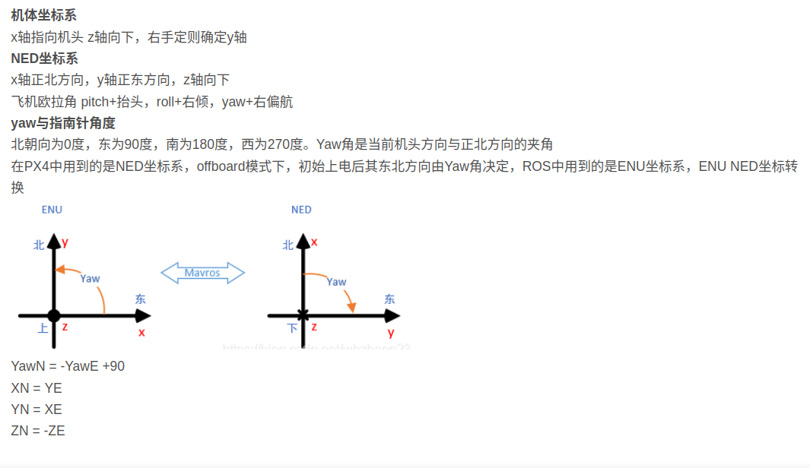

# 一、c++开发

主要来记录实际应用时，总结的解决方式

## 1.ENU和NED坐标系转化：




## 2.matplotlib学习

1.想要显示出随时间变化的效果，轨迹不断在生长

思路：不断的在容器中添加新的数据，然后清除之前的画布，再次plot，然后延时

```c++
for(int i=1; i<n; i++) {
    x.push_back(i);
    y.push_back(sin(2*M_PI*i/360.0));
    z.push_back(log(i));
    //不断往容器中压数据，才能产生这个一直走的效果
    if (i % 10 == 0) {
        plt::clf(); //清空之前的绘图，
        //两种绘图方式
        //方式一：
        plt::plot(x, y);
        //方式二：附带图例
        plt::named_plot("log(x)", x, y);
        plt::xlim(0, n*n);          //设置x-axis的取值范围
        plt::title("Sample figure");//添加标题
        plt::legend();              //使得可以标注
        plt::axis("equal") //坐标轴等比例
        //最重要的一步：延时，只有加上延时，才能在每一次循环结束后输出
        plt::pause(0.01);
    }
}
```

2.plot添加图例

```c++
plt::plot(x,y,{{"label","y=x+4"}}); //在变量后面加入一个map的消息，key为"label"，value为自定义的字符串。有两个花括号
plt::legend(); //加上这个legend后才能显示图例
```


## 3.枚举类实现switch

```c++
enum day = {mon , the , wed , thur , fri}
day today = mon;
switch(today)
{
    case mon:
        condition;
        break;
    case the:
        condition;
        break;
    case wed:
        consition;
        break;
    default:
        break;
}
```


## 4.调用M_PI

```c++
#define _USE_MATH_DEFINES
include <cmath>
```


## 5.点的旋转

平面坐标系中的任何一个点A（x1，y1），连接该点和原点组成一条向量，将这个向量按照a的旋转角度（逆时针旋转为正，顺时针旋转为负）旋转，旋转后的点B（x2，y2），二者之间的关系：

`[x2, y2]T = R* [x1, y1]T `，其中R是旋转矩阵，`R = [cos(a) , -sin(a) ; sin(a) , cos(a) ]` 顺逆时针只影响a的正负，不影响表达式

```c++
Cartesian WayPoint::rotate(Cartesian p1, double angle_rad)
{
    Cartesian p2;
    p2.x = cos(angle_rad)* p1.x - sin(angle_rad)* p1.y;
    p2.y = sin(angle_rad)* p1.x + cos(angle_rad)* p1.y;
    return p2;
}
```

推导过程可以考虑直线的极坐标表示


## 6.矩形的坐标变化

思路：先计算最好计算的情况（矩形中心店和原点重合，边长和坐标轴平行），然后进行旋转+平移，得到四个点的坐标

虚拟矩形中心定在坐标原点，长平行x轴，宽平行y轴

真实矩形中心坐标A为（x1 , y1），长边和点A与原点连线组成的向量垂直

- 计算中心点A的和x正半轴的夹角a，0-2π范围，均为正值
- 输入四个顶点坐标，输入问题5中的旋转角度为**`（a-π/2）`**，严格推导过，四个象限都一样
- 在四个顶点坐标x和y的基础上增加A的横纵坐标

```c++
//旋转矩阵，输入的旋转角度angle_rad为正时，绕着原点逆时针旋转，为负数时，顺时针旋转
Cartesian rotate(Cartesian p1, double angle_rad)
{
    Cartesian p2;
    p2.x = cos(angle_rad)* p1.x - sin(angle_rad)* p1.y;
    p2.y = sin(angle_rad)* p1.x + cos(angle_rad)* p1.y;
    return p2;
}
```


```c++
double angle_rad = atan2(centor.y,centor.x);
if(angle_rad < 0){
angle_rad += 2* M_PI;
}
left_down_rotate = rotate(left_down, angle_rad-M_PI/2);
right_down_rotate = rotate(right_down, angle_rad-M_PI/2);
right_up_rotate = rotate(right_up, angle_rad-M_PI/2);
left_up_rotate = rotate(left_up, angle_rad-M_PI/2);

left_down_trans = transform(left_down_rotate, centor.x, centor.y);
right_down_trans = transform(right_down_rotate, centor.x, centor.y);
right_up_trans = transform(right_up_rotate, centor.x, centor.y);
left_up_trans = transform(left_up_rotate, centor.x, centor.y);
```


## 7.atan2妙用

```c++
atan2(y,x); //计算点（x，y）和x正半轴的夹角，返回值在-M_PI到M_PI之间的弧度制
```

妙用技巧：有时候其他方式计算出来的一些角度不一定在-M_PI到M_PI，就可以通过以下方式转化在这个区间内

```c++
phic=(1/g)*(ddxc*sin(psides)-ddyc*cos(psides));
phic=atan2(sin(phic),cos(phic)); //这一行写的太妙了，计算一次sin和cos，再进行atan，就把区间转过来了
```


# 二、Eigen库使用

## 1.向量

定义：VectorXd，类似c++里面的容器

## 2.矩阵

定义：matrixXd，可以动态扩展

**构造函数**：

```c++
Eigen::MatrixXd matrix; //空的动态矩阵

Eigen::MatrixXd matrix(rows, cols); //默认都是0
Eigen::MatrixXd matrix(rows, cols).setConstant(num); //常数num填满

Eigen::MatrixXd matrix = Eigen::MatrixXd::Identity(rows, cols); //单位矩阵
```

**函数**：

```c++
.setIdentity() //单位化
.rows() //总行
.cols() //总列
.Zero() //0矩阵
.block(i,j,row,col) = (MatrixXd)... //从i,j的位置开始替换,替换多少行(row),替换多少列(rol)，注意右边必须是一个矩阵，VectorXd不可以充当等式右值
```


# 三、库的理解

## 1.动态库和静态库


| 方面           | 静态库                                                       | 动态库                                                       |
| -------------- | ------------------------------------------------------------ | ------------------------------------------------------------ |
| **文件扩展名** | `.a`（Linux/Unix）或 `.lib`（Windows）                       | `.so`（Linux/Unix）或 `.dll`（Windows）                      |
| **链接方式**   | 在链接阶段，库中的代码被直接复制到可执行文件中。             | 在链接阶段，只记录库的引用信息，代码不复制到可执行文件。     |
| **运行时行为** | 可执行文件包含所有库代码，运行时无需额外文件，独立性强。     | 可执行文件运行时需加载动态库，库文件必须存在于系统路径或指定目录。 |
| **文件大小**   | 可执行文件体积较大，因为包含了库的全部代码。                 | 可执行文件体积较小，仅包含引用信息，实际代码在动态库中。     |
| **内存使用**   | 每个使用静态库的可执行文件都有一份库代码的副本，内存占用可能较大。 | 多个程序可共享同一动态库的内存副本，节省内存。多个程序调用库时候，都是只有库自身的内存 |
| **更新性**     | 库更新后，需重新编译和链接整个程序。                         | 库更新后，只需替换动态库文件，无需重新编译程序（需版本兼容）。 |
| **加载速度**   | 运行时无需加载库，启动速度快。                               | 运行时需加载动态库，可能增加启动时间。                       |
| **部署**       | 部署简单，可执行文件独立运行，无需附带库文件。               | 部署复杂，需确保动态库存在且路径正确，否则运行失败。         |
| **生成方式**   | 使用 `ar` 工具打包目标文件（如 `ar rcs libmymath.a mymath.o`）。 | 使用编译器生成位置无关代码（PIC），如 `g++ -shared -o libmymath.so`。 |

## 2.动态库

意义：类似于函数，相当于直接封装了一个模块为二进制文件，其他文件可以使用，在链接阶段就是将主可执行文件和所有的dll整合成一个完整的exe文件

好处：可以写一些公共的算法，很多模块都可以公用这一个ddl

### 2.1 windows动态库

1. ### 基本知识

   后缀：dll

2. ### 导出

- 需要定义导出修饰符，意义是让其他文件使用dll时，可以找到对应的函数，如果不在函数前定义**导出修饰符**，那其他文件就没办法使用这个函数。参考微软官方说法：[演练：创建和使用自己的动态链接库 (C++) | Microsoft Learn](https://learn.microsoft.com/zh-cn/cpp/build/walkthrough-creating-and-using-a-dynamic-link-library-cpp?view=msvc-150)

  ```c++
  #define MATHLIBRARY_API __declspec(dllexport)
  
  extern "C" MATHLIBRARY_API void fibonacci_init(
  ```

- 如果要导出类内的所有公共成员函数，可以在hpp/h文件中，在类名前加上导出修饰符

  ```c++
  class MOVER_FALL_EXPORT WsfFallMover : public WsfMover
  ```

  

### 2.2 linux动态库

1. ### 基本知识

   后缀：so

2. ### 导出

- 不用加导出修饰符，导出的so所有的函数都对其他文件开放


# 四、生成可执行文件过程

## 1.**编写代码**：

编写头文件和源文件，定义程序的逻辑。
`.h`和`.hpp`本质上没有区别，`.h`是考虑了c语言的工程，保证c和c++都能使用，`.hpp`是纯c++项目才能使用

## 2.**预处理**：

处理头文件、宏等，生成预处理后的代码。

* 展开#include指令，将头文件内容插入到源文件中。
* 替换宏定义（如#define）。
* 处理条件编译指令（如#ifdef、#ifndef）。
* 删除注释，整理代码。

## 3.**编译**：

将预处理后的代码翻译成汇编代码，再翻译成机器码，生成目标文件。

编译器（如g++）将每个源文件（.cpp）单独编译为一个目标文件（.o或.obj）

## 4.**链接**：

将多个目标文件和库文件组合，生成最终的可执行文件。

* 如果第三方的库，函数的实现在对应的cpp文件中有，那么就不需要链接
* 如果第三方的库，函数的实现只存在与其提供的动态库（有可能是不希望泄漏源码），那就需要进行链接

## 5.**运行**：

操作系统加载可执行文件并运行。

## 6.g++使用

```
g++ <选项>
```

* **-o <输出文件>**：指定输出文件名。
* **-Wall**：启用大多数警告消息。
* **-Werror**：将警告视为错误。
* **-std=c++XX**：指定要使用的C++语言标准（例如 `c++11`、`c++14`、`c++17`、`c++20`）。
* **-I<目录>**：将目录添加到用于搜索头文件的目录列表中。
* **-L<目录>**：将目录添加到用于搜索库文件的目录列表中。
* **-l<库>**：与指定的库进行链接，从`-L`中查找，库名 ，lib+库名+.so/.lib/.dll组成完整库文件名。

举例

```
g++ -o my_program main.cpp function.cpp -I/usr/local/include/GeographicLib -L/usr/local/lib -lGeographicLib
```

* `-o my_program`：指定输出文件名为 `my_program`。
* `main.cpp functions.cpp`：指定要编译的源文件。
* `-I/usr/local/include/GeographicLib`：指定第三方库头文件目录 `.` 作为包含头文件的搜索路径。
* `-L/usr/local/lib`：指定第三方库库文件目录，作为包含库文件的搜索路径。
* `-lGeographicLib`：链接到名为 `GeographicLib` 的库文件。


# 四、visual studio开发

## 1.添加路径

visual studio添加方式有以下几种：

- **在cmakelists里添加**，在这种格式下，添加的头文件和库文件路径都会自动添加到vs中

- **在vs中添加**

  1. **include文件**：右键对应的模块，点击最下面的属性，选择c/c++的常规，后面的附加包含目录点开新建

     

  2. **库文件**：点击左边链接器，同样输入，但是这个只能添加lib导入库，不能添加dll库，否则会出现link1009的报错

     

  

  
