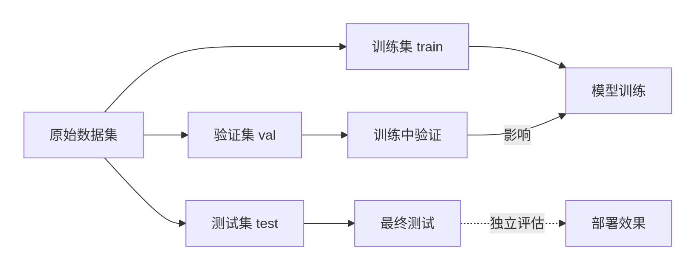
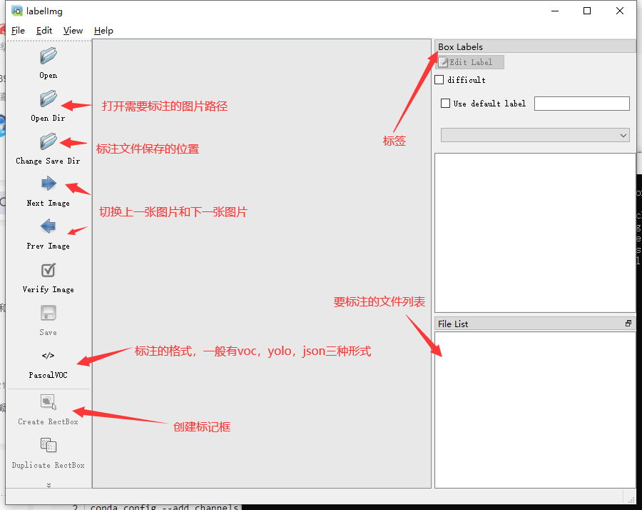
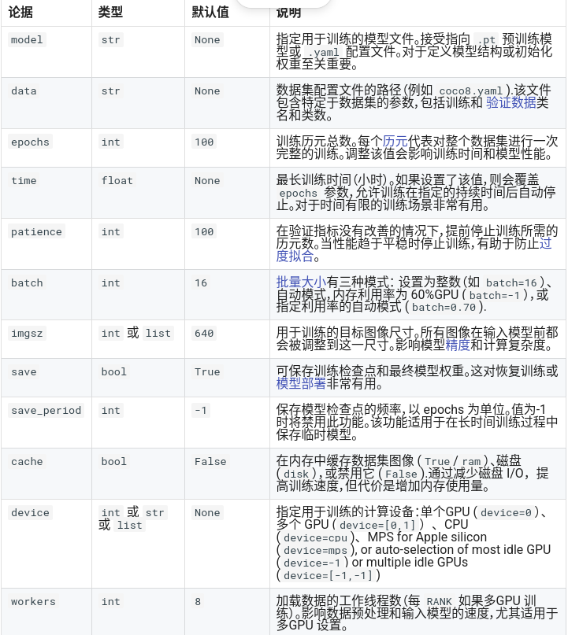

# ubuntu下yolov8配置：

## 一、环境配置

### 1.安装anaconda

参考链接：只用看第二节，https://blog.csdn.net/zardforever123/article/details/133432077?spm=1001.2014.3001.5501，conda下载链接：https://www.anaconda.com/download#Downloads

如果不希望每次打开终端都显示base环境，输入以下内容。后续激活时，在任意终端中输入conda activate base即可

```
conda config --set auto_activate_base false
```

### 2.安装yolov8

参考链接：https://blog.csdn.net/zardforever123/article/details/134338193，几行命令即可

```
# 新建虚拟环境
conda create -n yolov8 python=3.8
# 激活虚拟环境
conda activate yolov8
# 使用清华大学的镜像源安装
pip install ultralytics -i  https://pypi.tuna.tsinghua.edu.cn/simple/
```

yolo代码存放路径：

```
/home/bit/anaconda3/envs/yolov8/lib/python3.8/site-packages/ultralytics
```

### 3.验证ultralytics环境

```python
python3
import ultralytics
ultralytics.checks()
```

应该输出：


### 4.修改yolov8数据集、模型存放路径

参考链接：https://blog.csdn.net/Functioe/article/details/137873067，第3节

输入yolo settings，查看默认路径，修改json文件的保存路径

在主目录下隐藏文件config中的ultralytics文件夹下的json文件

### 5.运行官方模型例子

参考链接：https://blog.csdn.net/zardforever123/article/details/134338193，第一章1.2节

使用yolo命令时，首先要进到conda环境中，才能正确识别命令

```
#官方的测试案例进行程序的推理测试：
yolo task=detect mode=predict model=yolov8n.pt source=/home/zard/Pictures/2.jpeg  device=cpu save=True show=True
# 任务模型task=detect，YOLOv8可用于检测，分割，姿态和分类
# 会自动下载权重文件https://github.com/ultralytics/assets/releases/download/v0.0.0/yolov8n.pt到当前目录
# 推理的数据为source
# 这是CPU进行测试的，将device改为0用GPU
```


## 二、数据集标注

使用labelimg进行标准

### 1.下载labelimg

激活conda环境（可以和yolov8在同一个conda环境下）

```
pip install labelimg
```

### 2.使用labelimg

进入conda环境后，输入`lableImg`，注意这里的Img首字母是大写

### 3.构建数据集结构

1. 首先在主目录下隐藏文件config中的ultralytics文件夹下的json文件路径下的datasets文件夹下，`参考一、环境配置4中的路径，在台式机中的位置为：/home/bit/yolov8/datasets`，创建数据集名称

2. 在数据集名称下，新建文件夹`images,lables`，分别存放图像和标签，文件夹的名称是固定的，yolo可以自动识别

3. 在`images`文件夹下，创建train文件夹，val文件夹，test（这个可选），分别是训练集，验证集，测试集，三个文件夹下都存放图像

   * 训练集，验证集，测试集中的图片都是独立的，不能一样

   * 验证集和测试集的区别，验证集相当于月考模拟，找到自身的问题，然后影响后续i的学习成绩。测试集相当于高考，是最后模型训练完毕的评估

   * | **对比项**       | **验证集（val）**                | **测试集（test）**                   |
     | ---------------- | -------------------------------- | ------------------------------------ |
     | **用途**         | 训练中监控模型、调参、早停       | **最终**评估模型泛化能力（仅用一次） |
     | **使用阶段**     | 每个Epoch结束后使用              | 所有训练和调参完成后使用             |
     | **数据重叠**     | 与训练集完全独立                 | 与训练集、验证集完全独立             |
     | **是否影响训练** | 是（影响超参数、早停、模型选择） | 否（不参与任何训练或决策）           |
     | **数据量**       | 通常占10%~20%                    | 通常占5%~10%                         |

     

4. 在`lables`文件夹下，创建和images文件夹下相同结构名称的文件夹，**名称一定要相同**，因为yolo会自动替换将images替换为labels，所有文件夹下存放对应图像的标签信息，图像名称和标签名称一定要对的上（如果正常使用labelimg，名称是对的上的）

5. 整体结构如下所示：

```
datasets/
├──target_uav #数据集名称
    ├── images/
    │   ├── train/       # 训练图像（如0001.jpg, 0002.jpg,...）
    │	├── val/         # 验证图像（如1001.jpg, 1002.jpg,...）
    │   └── test/        # 测试图像（如2001.jpg, 2002.jpg,...）
    └── labels/
        ├── train/       # 训练标签（如0001.txt, 0002.txt,...）
        ├── val/         # 验证标签（如1001.txt, 1002.txt,...）
    	└── test/        # 测试标签（如2001.txt, 2002.txt,...）
```

### 4.打标记

可以打完标记再分为训练集、验证集、测试集，也可以分为训练集、验证集、测试集，在打标记

注意先选择标注格式为yolo，这样打的标记才为txt，否则标记为xml等格式还得转化

参考链接：https://blog.xiaoqi.work/index.php/2024/03/25/yolov8_train_own_dataset/

三个快捷键：

```
w：打标记
cirl+s：保存标签
D：下一张
```



## 三、模型训练

### 1.配置yaml

在`/home/bit/anaconda3/envs/yolov8/lib/python3.8/site-packages/ultralytics/cfg/datasets`路径下有模型训练的配置文件例子，以`coco128举例`，可以在`/home/bit/anaconda3/envs/yolov8/lib/python3.8/site-packages/ultralytics/cfg/model/v8`路径下新建自己的配置文件`target_uav.yaml`

```yaml
path: /home/bit/yolov8/datasets/target_uav           # 数据集的根目录
train: images/train                                  # 拼接数据级的根目录下的图像训练集
val: images/val                                      # 拼接数据级的根目录下的图像验证集
test: images/test #这个是非必须的，可选，评估模型的好坏    # 拼接数据级的根目录下的图像测试集
#不用担心标签找不到，；yolo会自动将train、val、test等变量的images换成labels，所以就要求数据集的文件夹名称是固定的
names: 
  0: target_uav #类别，从0开始，每一类的名称的数据集标签结果classes.txt中的名称保持一致
```

### 2.训练

首先激活yolo环境，然后在终端中输入：

`yolo detect train data=/home/bit/anaconda3/envs/yolov8/lib/python3.8/site-packages/ultralytics/cfg/models/v8/target_uav.yaml model=yolov8n.yaml epochs=100 imgsz=640 resume=True`，

* `data`后面是自己配置的yaml文件，
* `model`后面是官方提供的模型，有不同大小的模型，参照`/home/bit/anaconda3/envs/yolov8/lib/python3.8/site-packages/ultralytics/cfg/models/v8/yoloe-v8.yaml`这个文件中的解释，
* `epochs`代表训练轮数，太小欠拟合，太大过拟合
* `imgsz`会选择是否将图片压缩成指定的尺寸
* `resume`表示模型训练中止后会接着终止的地方训练，默认是false，需要打开
* 其他的参数意思在https://docs.ultralytics.com/zh/modes/train/#introduction有介绍



### 3.结果

结果存储在一章4节修改的config文件中的存放路径runs中，训练完会在终端中显示结果存放在哪

best.pt就是训练出的最优权重文件

### 4.测试

`yolo task=detect mode=predict model=/home/bit/yolov8/runs/detect/train3/weights/best.pt source=/home/bit/yolov8/mytest/1.png  device=0 save=True show=True`
