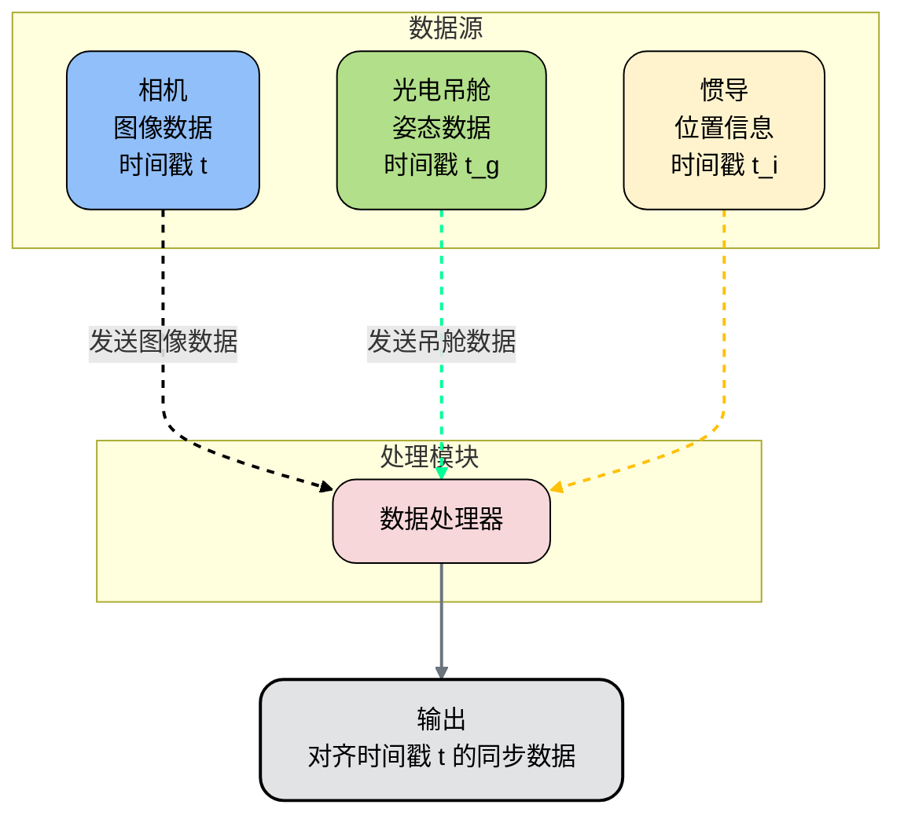

# 本子技巧：

## 1.mermaid绘图：

```mermaid
flowchart TD
    subgraph 数据源
        C[ 相机<br/>图像数据<br/>时间戳 t]:::camera
        G[ 光电吊舱<br/>姿态数据<br/>时间戳 t_g]:::pod
        I[ 惯导<br/>位置信息<br/>时间戳 t_i]:::imu
    end

    subgraph 处理模块
        D[ 数据处理器]:::processor
    end

    C -- 发送图像数据 --> D
    G -. 发送吊舱数据 .-> D
    I ===> D

    D --> R[ 输出<br/>对齐时间戳 t 的同步数据]:::result

    classDef camera fill:#91BFFA,stroke:#000000,stroke-width:1px,color:#000000,rx:15px,ry:15px;
    classDef pod fill:#B2DF8A,stroke:#000000,stroke-width:1px,color:#000000,rx:15px,ry:15px;
    classDef imu fill:#fff3cd,stroke:#000000,stroke-width:1px,color:#000000,rx:15px,ry:15px;
    classDef processor fill:#f8d7da,stroke:#000000,stroke-width:1px,color:#000000,rx:15px,ry:15px;
    classDef result fill:#e2e3e5,stroke:#000000,stroke-width:2px,color:#000000,rx:15px,ry:15px;

	linkStyle 0 stroke:#000000, stroke-width:2px, stroke-dasharray: 5 5;
	linkStyle 1 stroke:#00ff98, stroke-width:2px, stroke-dasharray: 5 5;
	linkStyle 2 stroke:#ffc107, stroke-width:2px, stroke-dasharray: 5 5;
	linkStyle 3 stroke:#6c757d, stroke-width:2px;
```

2.

